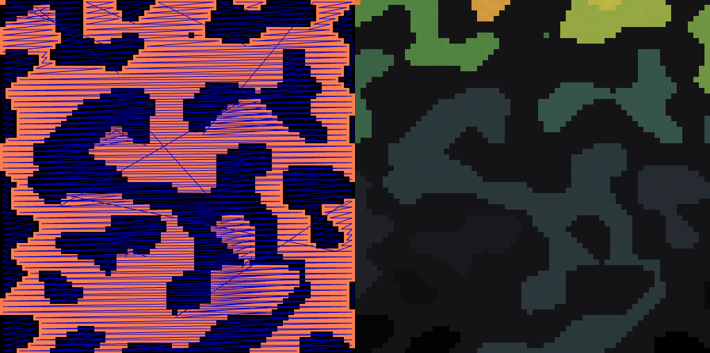
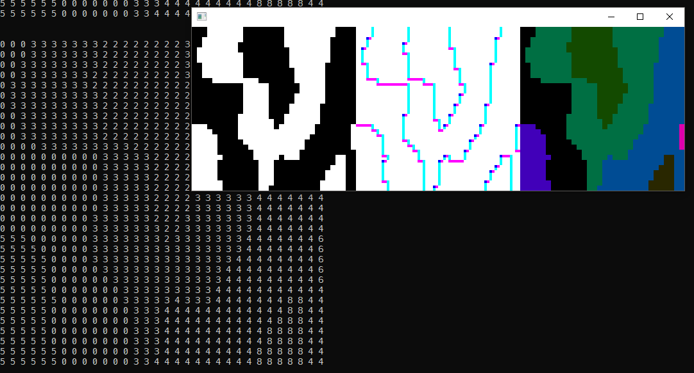

How do you find the groups of a two-dimensional binary bitmap reading linearly?
Linearly meaning like how you'd read a book.

The object of this code is to take a grid of bits and then color them according to their groupings using this type of reading. The left pane is the grid of bits, with lines drawn between groups, and the right pane is the bitmap colored.

## Old

## Why?
It gave me the opportunity to start learning C++ and gain some familiarity with OpenFrameworks. How many ways can we read an image?
